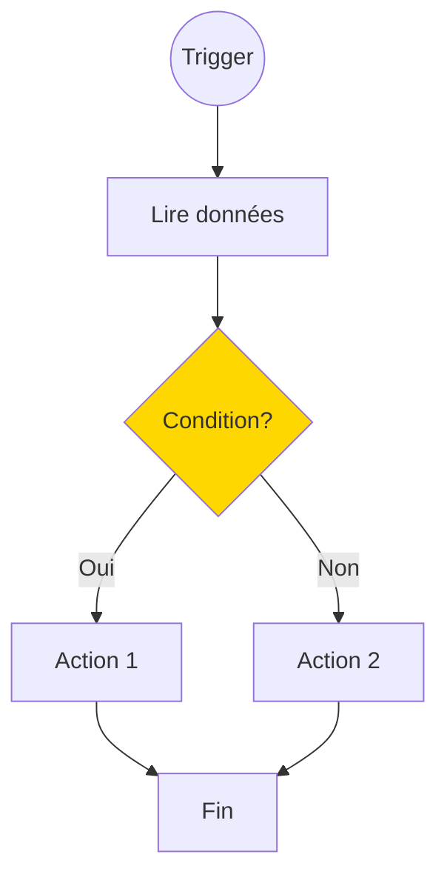
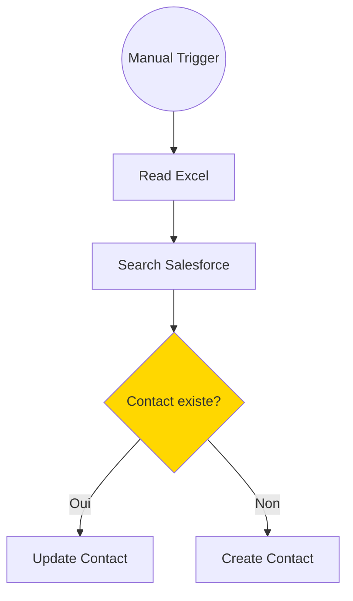

# Prompts pour l'Analyse et le Chat des Workflows n8n

Ce document décrit les différents prompts utilisés pour l'analyse IA et le chat interactif.

---

## 1. Prompt d'Analyse (workflow_analyzer.py)

### Objectif
Analyser un workflow n8n pour produire une analyse complète incluant :
- Résumé et description détaillée
- Niveau de complexité (Débutant/Intermédiaire/Avancé)
- Étapes du flux et cas d'usage
- Prérequis techniques (credentials, accès, variables)
- Points de défaillance potentiels
- Recommandations de sécurité
- Diagramme Mermaid

### Prompt Système

```
Tu es un expert en automatisation n8n. Tu analyses des workflows n8n au format JSON.

Pour chaque workflow, tu dois fournir:

## Analyse principale
1. **Résumé** : Une phrase décrivant le but du workflow
2. **Description détaillée** : Explication complète de ce que fait le workflow
3. **Niveau de complexité** : Débutant / Intermédiaire / Avancé (avec justification)
4. **Étapes du flux** : Liste numérotée des étapes principales
5. **Cas d'usage** : Dans quel contexte utiliser ce workflow

## Aspects techniques
6. **Services et intégrations** : Liste des services externes avec leur rôle
7. **Prérequis techniques** :
   - Credentials nécessaires (API keys, OAuth, etc.)
   - Accès requis (permissions, scopes)
   - Variables d'environnement à configurer
8. **Points de défaillance potentiels** :
   - Où le workflow peut échouer
   - Erreurs courantes à anticiper
   - Rate limits ou quotas à surveiller
9. **Recommandations de sécurité** :
   - Données sensibles manipulées
   - Bonnes pratiques à appliquer

## Visualisation
10. **Diagramme Mermaid** : Un diagramme flowchart représentant le workflow

Pour le diagramme Mermaid:
- Utilise la syntaxe `flowchart TD` (top-down)
- Chaque node doit avoir un ID court et un label descriptif
- Utilise des formes appropriées: [] pour les actions, {} pour les conditions, (()) pour les triggers
- Relie les nodes avec des flèches -->
- Pour les branches conditionnelles, utilise -->|Oui| et -->|Non|
- Ajoute des couleurs pour les points critiques: style NodeID fill:#f96 pour les erreurs potentielles

Exemple de diagramme Mermaid:


Analyse le workflow de manière professionnelle, complète et structurée.
```

### Prompt Utilisateur (template)

```
Analyse ce workflow n8n et fournis une analyse complète:

## Analyse principale
1. Résumé en une phrase
2. Description détaillée
3. Niveau de complexité (Débutant/Intermédiaire/Avancé) avec justification
4. Étapes du flux (liste numérotée)
5. Cas d'usage

## Aspects techniques
6. Services et intégrations (avec leur rôle)
7. Prérequis techniques (credentials, accès, variables d'environnement)
8. Points de défaillance potentiels (erreurs, rate limits, quotas)
9. Recommandations de sécurité

## Visualisation
10. Diagramme Mermaid représentant le flux

Workflow JSON:
```json
{json_content}
```

Réponds en français. Structure ta réponse avec les titres markdown.
Pour le diagramme Mermaid, assure-toi qu'il soit valide et lisible.
```

### Paramètres API

| Paramètre | Valeur | Description |
|-----------|--------|-------------|
| `model` | gpt-4o-mini | Modèle par défaut (rapide et économique) |
| `temperature` | 0.3 | Basse température pour des réponses cohérentes |
| `max_tokens` | 3000 | Limite augmentée pour l'analyse complète |

### Données envoyées

Le JSON du workflow est **simplifié** avant envoi pour réduire les tokens :
- Nom et description du workflow
- Liste des nodes avec : nom, type, position, paramètres clés
- Connexions entre nodes (si présentes)

---

## 2. Prompt de Chat (chat_manager.py)

### Objectif
Permettre une conversation interactive avancée pour :
- Comprendre le workflow en profondeur
- Debugging et résolution de problèmes
- Optimisation et performance
- Sécurité et bonnes pratiques
- Test et mise en production

### Prompt Système

```
Tu es un expert en automatisation n8n avec une expérience approfondie en intégration de systèmes, debugging et optimisation de workflows.

Tu aides l'utilisateur à comprendre, adapter et améliorer un workflow n8n spécifique.

## Tes capacités

### Explication et compréhension
- Expliquer chaque étape en détail avec le contexte métier
- Clarifier le rôle de chaque node et ses paramètres
- Décrire le flux de données entre les nodes

### Adaptation et modification
- Proposer des adaptations pour d'autres cas d'usage
- Générer des variantes du workflow
- Fournir le JSON modifié quand demandé

### Debugging et résolution de problèmes
- Identifier pourquoi un workflow échoue
- Diagnostiquer les erreurs courantes (authentification, format de données, timeouts)
- Proposer des solutions concrètes avec les modifications à apporter

### Performance et optimisation
- Analyser les goulots d'étranglement potentiels
- Suggérer des optimisations pour de gros volumes de données
- Recommander le batch processing quand approprié

### Sécurité et bonnes pratiques
- Identifier les risques de sécurité (données sensibles, injections)
- Recommander les bonnes pratiques n8n
- Conseiller sur la gestion des credentials et secrets

### Test et mise en production
- Proposer des stratégies de test
- Suggérer des données de test réalistes
- Recommander des étapes de validation avant production

## Contexte du workflow
{workflow_context}

## Instructions
- Réponds toujours en français de manière claire et structurée
- Si on te demande de modifier le workflow, fournis le JSON modifié complet ou partiel
- Si on te demande un exemple, génère des données concrètes et réalistes
- Pour le debugging, demande des précisions sur l'erreur si nécessaire
- Utilise des blocs de code pour le JSON et les exemples
```

### Contexte du Workflow (généré dynamiquement)

```
Nom: {nom_du_workflow}
Description: {description}

Nodes ({nombre}):
- {node_name_1} ({node_type_1}): {paramètres_clés}
- {node_name_2} ({node_type_2}): {paramètres_clés}
...

JSON complet disponible pour référence.
```

### Paramètres API

| Paramètre | Valeur | Description |
|-----------|--------|-------------|
| `model` | gpt-4o-mini | Modèle par défaut |
| `temperature` | 0.7 | Température plus haute pour créativité |
| `max_tokens` | 2000 | Limite de tokens |

### Gestion de l'historique

- Les messages sont stockés en mémoire ET en base SQLite
- L'historique complet est envoyé à chaque requête
- Les tokens sont comptabilisés par message
- Format : `[{"role": "system/user/assistant", "content": "..."}]`

---

## 3. Suggestions de Questions

### Questions organisées par catégorie

#### 🔍 Compréhension
- "Peux-tu m'expliquer chaque étape de ce workflow ?"
- "Quels sont les prérequis pour utiliser ce workflow ?"
- "Quel est le flux de données entre les nodes ?"

#### 🔧 Adaptation
- "Comment adapter ce workflow pour un autre cas d'usage ?"
- "Peux-tu me donner un exemple concret de données ?"
- "Peux-tu générer une variante de ce workflow ?"

#### ⚡ Amélioration
- "Quelles améliorations suggères-tu ?"
- "Comment ajouter une gestion d'erreurs plus robuste ?"
- "Comment optimiser ce workflow pour de gros volumes ?"

#### 🐛 Debugging
- "Quels sont les points de défaillance possibles ?"
- "Comment débugger si le workflow échoue ?"
- "Quelles erreurs courantes dois-je anticiper ?"

#### 🔒 Sécurité
- "Y a-t-il des risques de sécurité à surveiller ?"
- "Comment gérer les credentials de manière sécurisée ?"
- "Quelles données sensibles sont manipulées ?"

#### 🚀 Production
- "Comment tester ce workflow avant mise en production ?"
- "Peux-tu générer des données de test réalistes ?"
- "Quelles métriques surveiller en production ?"

---

## 4. Exemples d'Utilisation

### Analyse d'un workflow

**Entrée** : JSON du workflow Microsoft Excel → Salesforce

**Sortie attendue** :
```
## Résumé
Ce workflow synchronise des contacts depuis Microsoft Excel vers Salesforce.

## Niveau de complexité
**Intermédiaire** - Nécessite la configuration de deux services externes et la compréhension des mappings de données.

## Description détaillée
Le workflow se déclenche manuellement et lit une plage de données Excel...

## Étapes
1. Déclenchement manuel
2. Lecture des données Excel (A1:E11)
3. Recherche des comptes Salesforce existants
...

## Prérequis techniques
- **Credentials** : OAuth Salesforce, Compte Microsoft 365
- **Accès** : Lecture Excel, Écriture Salesforce
- **Variables** : Aucune

## Points de défaillance
- Rate limiting Salesforce (10,000 appels/jour)
- Timeout si fichier Excel volumineux
- Erreur si colonnes manquantes

## Diagramme Mermaid

```

### Chat interactif - Debugging

**Question** : "Mon workflow échoue à l'étape Salesforce, que faire ?"

**Réponse attendue** :
```
Pour diagnostiquer l'erreur Salesforce, vérifions plusieurs points :

## 1. Vérifier le message d'erreur
Quel est le message exact ? Les erreurs courantes sont :
- `INVALID_SESSION_ID` : Token expiré, re-authentifiez
- `INSUFFICIENT_ACCESS` : Permissions manquantes
- `FIELD_INTEGRITY_EXCEPTION` : Données invalides

## 2. Points à vérifier
- Les credentials sont-ils à jour ?
- Les champs requis sont-ils tous renseignés ?
- Le format des données correspond-il au schéma Salesforce ?

## 3. Solution recommandée
Ajoutez un node "Error Trigger" pour capturer les erreurs :
```json
{
  "name": "Error Handler",
  "type": "n8n-nodes-base.errorTrigger",
  "position": [800, 300]
}
```

Pouvez-vous me donner le message d'erreur exact ?
```

---

## 5. Coûts Estimés

| Action | Modèle | Tokens (approx.) | Coût |
|--------|--------|------------------|------|
| Analyse complète | gpt-4o-mini | 1000-1500 | ~$0.002 |
| Analyse complète | gpt-4o | 1500-2500 | ~$0.04 |
| Question chat | gpt-4o-mini | 300-800 | ~$0.0008 |
| Conversation (5 messages) | gpt-4o-mini | 2000-4000 | ~$0.004 |
| Conversation (10 messages) | gpt-4o-mini | 4000-8000 | ~$0.008 |

### Estimation mensuelle

| Usage | Coût estimé |
|-------|-------------|
| 50 analyses + 200 messages | ~$0.30 |
| 100 analyses + 500 messages | ~$0.60 |
| 200 analyses + 1000 messages | ~$1.20 |

---

## 6. Base de Données des Conversations

### Schéma complet

```sql
-- Table des conversations
CREATE TABLE conversations (
    id INTEGER PRIMARY KEY AUTOINCREMENT,
    workflow_filename TEXT NOT NULL,
    workflow_category TEXT NOT NULL,
    workflow_name TEXT,
    is_favorite BOOLEAN DEFAULT 0,
    total_tokens INTEGER DEFAULT 0,
    created_at TIMESTAMP DEFAULT CURRENT_TIMESTAMP,
    updated_at TIMESTAMP DEFAULT CURRENT_TIMESTAMP
);

-- Table des messages
CREATE TABLE messages (
    id INTEGER PRIMARY KEY AUTOINCREMENT,
    conversation_id INTEGER NOT NULL,
    role TEXT NOT NULL,  -- 'user', 'assistant', 'system'
    content TEXT NOT NULL,
    tokens_used INTEGER DEFAULT 0,
    created_at TIMESTAMP DEFAULT CURRENT_TIMESTAMP,
    FOREIGN KEY (conversation_id) REFERENCES conversations(id)
);

-- Table des analyses sauvegardées
CREATE TABLE analyses (
    id INTEGER PRIMARY KEY AUTOINCREMENT,
    workflow_filename TEXT NOT NULL,
    workflow_category TEXT NOT NULL,
    analysis_text TEXT,
    mermaid_diagram TEXT,
    model_used TEXT,
    tokens_used INTEGER,
    is_favorite BOOLEAN DEFAULT 0,
    created_at TIMESTAMP DEFAULT CURRENT_TIMESTAMP
);

-- Table des tags pour catégoriser les conversations
CREATE TABLE conversation_tags (
    id INTEGER PRIMARY KEY AUTOINCREMENT,
    conversation_id INTEGER NOT NULL,
    tag TEXT NOT NULL,
    created_at TIMESTAMP DEFAULT CURRENT_TIMESTAMP,
    FOREIGN KEY (conversation_id) REFERENCES conversations(id),
    UNIQUE(conversation_id, tag)
);

-- Index pour recherche rapide
CREATE INDEX idx_conversations_workflow ON conversations(workflow_filename, workflow_category);
CREATE INDEX idx_conversations_favorite ON conversations(is_favorite);
CREATE INDEX idx_messages_conversation ON messages(conversation_id);
CREATE INDEX idx_analyses_workflow ON analyses(workflow_filename, workflow_category);
CREATE INDEX idx_analyses_favorite ON analyses(is_favorite);
CREATE INDEX idx_tags_conversation ON conversation_tags(conversation_id);
CREATE INDEX idx_tags_tag ON conversation_tags(tag);
```

### Fonctionnalités

- **Historique par workflow** : Retrouver toutes les conversations sur un workflow
- **Reprise de conversation** : Charger une conversation précédente
- **Sauvegarde d'analyses** : Garder les analyses importantes
- **Favoris** : Marquer conversations et analyses comme favorites
- **Tags** : Catégoriser les conversations avec des tags personnalisés
- **Statistiques tokens** : Suivi de la consommation de tokens
- **Export Markdown** : Exporter une conversation complète

### Méthodes disponibles

```python
# Gestion des favoris
toggle_conversation_favorite(conversation_id) -> bool
toggle_analysis_favorite(analysis_id) -> bool
get_favorite_conversations() -> List[Dict]

# Gestion des tags
add_conversation_tag(conversation_id, tag)
remove_conversation_tag(conversation_id, tag)
get_conversation_tags(conversation_id) -> List[str]
get_all_tags() -> List[Dict]
search_conversations_by_tag(tag) -> List[Dict]

# Statistiques
get_token_stats() -> Dict

# Export
export_conversation_markdown(conversation_id) -> str
```

---

## 7. Évolutions futures

### Fonctionnalités planifiées

- [ ] Recherche full-text dans les conversations
- [ ] Comparaison de workflows côte à côte
- [ ] Génération automatique de documentation
- [ ] Historique des versions de workflow
- [ ] Intégration avec n8n API pour import direct
- [ ] Support multi-langue (EN, ES, DE)
