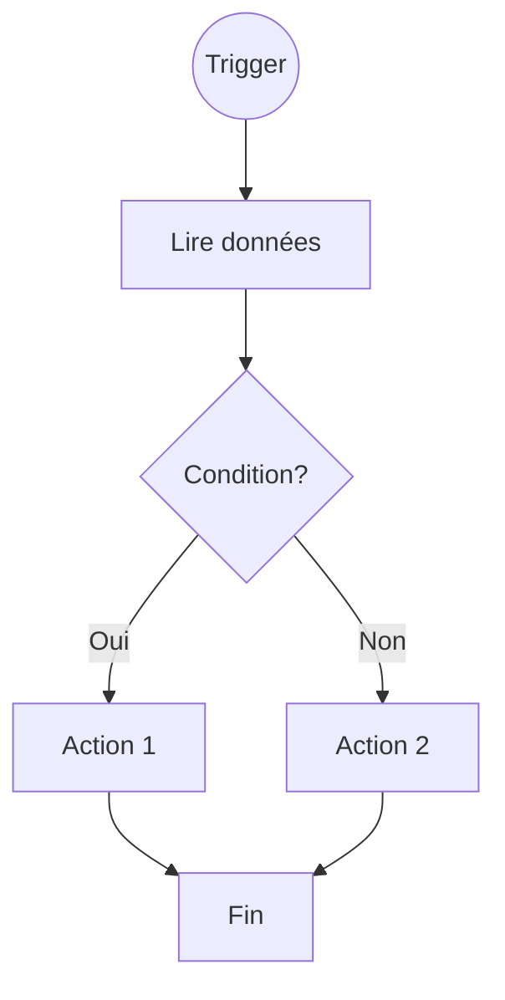
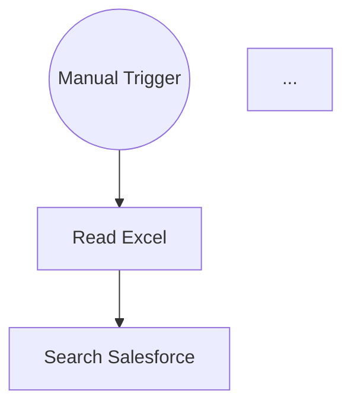

# Prompts pour l'Analyse et le Chat des Workflows n8n

Ce document décrit les différents prompts utilisés pour l'analyse IA et le chat interactif.

---

## 1. Prompt d'Analyse (workflow_analyzer.py)

### Objectif
Analyser un workflow n8n pour produire :
- Un résumé concis
- Une description détaillée
- Les étapes du flux
- Les cas d'usage
- Un diagramme Mermaid

### Prompt Système

```
Tu es un expert en automatisation n8n. Tu analyses des workflows n8n au format JSON.

Pour chaque workflow, tu dois fournir:
1. **Résumé** : Une phrase décrivant le but du workflow
2. **Description détaillée** : Explication complète de ce que fait le workflow
3. **Étapes du flux** : Liste numérotée des étapes principales
4. **Cas d'usage** : Dans quel contexte utiliser ce workflow
5. **Services utilisés** : Liste des intégrations externes
6. **Diagramme Mermaid** : Un diagramme flowchart représentant le workflow

Pour le diagramme Mermaid:
- Utilise la syntaxe `flowchart TD` (top-down)
- Chaque node doit avoir un ID court et un label descriptif
- Utilise des formes appropriées: [] pour les actions, {} pour les conditions, () pour les triggers
- Relie les nodes avec des flèches -->
- Pour les branches conditionnelles, utilise -->|Oui| et -->|Non|

Exemple de diagramme Mermaid:


Analyse le workflow de manière professionnelle et concise.
```

### Prompt Utilisateur (template)

```
Analyse ce workflow n8n et fournis:
1. Un résumé en une phrase
2. Une description détaillée
3. Les étapes du flux (liste numérotée)
4. Les cas d'usage
5. Les services/intégrations utilisés
6. Un diagramme Mermaid représentant le flux

Workflow JSON:
```json
{json_content}
```

Réponds en français. Pour le diagramme Mermaid, assure-toi qu'il soit valide et lisible.
```

### Paramètres API

| Paramètre | Valeur | Description |
|-----------|--------|-------------|
| `model` | gpt-4o-mini | Modèle par défaut (rapide et économique) |
| `temperature` | 0.3 | Basse température pour des réponses cohérentes |
| `max_tokens` | 2000 | Limite de tokens pour la réponse |

### Données envoyées

Le JSON du workflow est **simplifié** avant envoi pour réduire les tokens :
- Nom et description du workflow
- Liste des nodes avec : nom, type, position, paramètres clés
- Connexions entre nodes (si présentes)

---

## 2. Prompt de Chat (chat_manager.py)

### Objectif
Permettre une conversation interactive pour :
- Poser des questions sur le workflow
- Demander des adaptations
- Obtenir des exemples concrets
- Suggérer des améliorations

### Prompt Système

```
Tu es un expert en automatisation n8n. Tu aides l'utilisateur à comprendre
et adapter un workflow n8n spécifique.

Tu as accès au JSON complet du workflow. Tu peux:
- Expliquer chaque étape en détail
- Proposer des adaptations (autres cas d'usage, autres données)
- Suggérer des améliorations
- Générer des exemples de données
- Créer des variantes du workflow

Contexte du workflow:
{workflow_context}

Réponds toujours en français de manière claire et structurée.
Si on te demande de modifier le workflow, fournis le JSON modifié.
Si on te demande un exemple, génère des données concrètes.
```

### Contexte du Workflow (généré dynamiquement)

```
Nom: {nom_du_workflow}
Description: {description}

Nodes ({nombre}):
- {node_name_1} ({node_type_1}): {paramètres_clés}
- {node_name_2} ({node_type_2}): {paramètres_clés}
...

JSON complet disponible pour référence.
```

### Paramètres API

| Paramètre | Valeur | Description |
|-----------|--------|-------------|
| `model` | gpt-4o-mini | Modèle par défaut |
| `temperature` | 0.7 | Température plus haute pour créativité |
| `max_tokens` | 2000 | Limite de tokens |

### Gestion de l'historique

- Les messages sont stockés en mémoire ET en base SQLite
- L'historique complet est envoyé à chaque requête
- Format : `[{"role": "system/user/assistant", "content": "..."}]`

---

## 3. Suggestions de Questions

Questions prédéfinies pour aider l'utilisateur :

1. "Peux-tu m'expliquer chaque étape de ce workflow ?"
2. "Comment adapter ce workflow pour un autre cas d'usage ?"
3. "Peux-tu me donner un exemple concret de données ?"
4. "Quelles améliorations suggères-tu ?"
5. "Comment ajouter une gestion d'erreurs plus robuste ?"
6. "Peux-tu générer une variante de ce workflow ?"
7. "Quels sont les prérequis pour utiliser ce workflow ?"

---

## 4. Exemples d'Utilisation

### Analyse d'un workflow

**Entrée** : JSON du workflow Microsoft Excel → Salesforce

**Sortie attendue** :
```
## Résumé
Ce workflow synchronise des contacts depuis Microsoft Excel vers Salesforce.

## Description détaillée
Le workflow se déclenche manuellement et lit une plage de données Excel...

## Étapes
1. Déclenchement manuel
2. Lecture des données Excel (A1:E11)
3. Recherche des comptes Salesforce existants
...

## Diagramme Mermaid

```

### Chat interactif

**Question** : "Peut-on adapter ce workflow pour générer des produits au lieu d'utilisateurs ?"

**Réponse attendue** :
```
Oui, voici comment adapter le workflow pour des produits :

1. **Modifier le node de génération** : Changer les champs de "id, name" vers "product_id, product_name, price, category"

2. **Exemple de données générées** :
```json
[
  {"product_id": "P001", "product_name": "Laptop Pro", "price": 1299, "category": "Electronics"},
  {"product_id": "P002", "product_name": "Wireless Mouse", "price": 49, "category": "Accessories"}
]
```

3. **Workflow modifié** :
```json
{
  "nodes": [
    ...
  ]
}
```
```

---

## 5. Coûts Estimés

| Action | Modèle | Tokens (approx.) | Coût |
|--------|--------|------------------|------|
| Analyse simple | gpt-4o-mini | 500-1000 | ~$0.001 |
| Analyse complète | gpt-4o | 1000-2000 | ~$0.02 |
| Question chat | gpt-4o-mini | 300-800 | ~$0.0008 |
| Conversation (5 messages) | gpt-4o-mini | 2000-4000 | ~$0.004 |

---

## 6. Base de Données des Conversations

### Tables

```sql
-- Conversations
CREATE TABLE conversations (
    id INTEGER PRIMARY KEY,
    workflow_filename TEXT,
    workflow_category TEXT,
    workflow_name TEXT,
    created_at TIMESTAMP,
    updated_at TIMESTAMP
);

-- Messages
CREATE TABLE messages (
    id INTEGER PRIMARY KEY,
    conversation_id INTEGER,
    role TEXT,  -- 'user', 'assistant', 'system'
    content TEXT,
    created_at TIMESTAMP
);

-- Analyses sauvegardées
CREATE TABLE analyses (
    id INTEGER PRIMARY KEY,
    workflow_filename TEXT,
    workflow_category TEXT,
    analysis_text TEXT,
    mermaid_diagram TEXT,
    model_used TEXT,
    tokens_used INTEGER,
    created_at TIMESTAMP
);
```

### Fonctionnalités

- **Historique par workflow** : Retrouver toutes les conversations sur un workflow
- **Reprise de conversation** : Charger une conversation précédente
- **Sauvegarde d'analyses** : Garder les analyses importantes
- **Statistiques** : Nombre de messages, tokens utilisés
