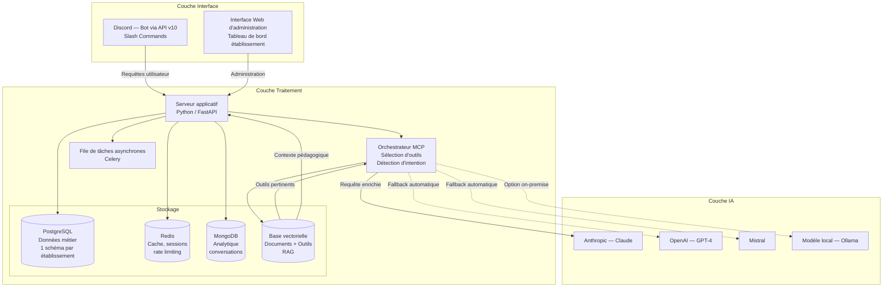
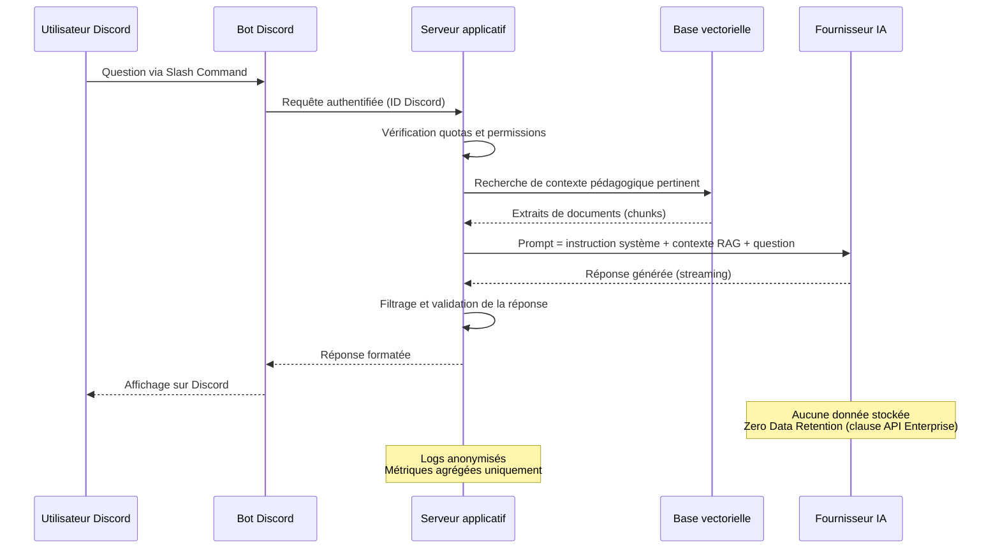
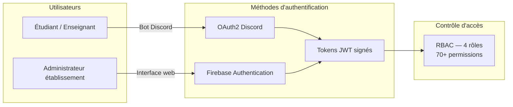
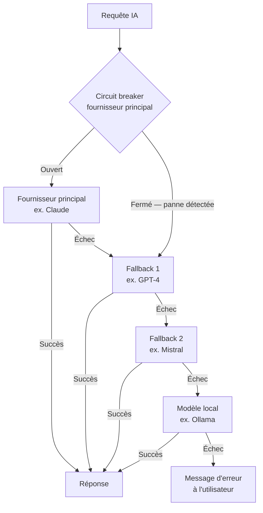

# Fiche Technique — Bot Pédagogique IA (Discord)

**À destination des DSI, RSSI et DPO**

| | |
|---|---|
| **Version** | 2.0 — Mars 2026, revue par l'équipe back-end API |
| **Version** | 2.1 — Mars 2026, revue par l'équipe MCP (orchestration) |
| **Version** | 2.2 — Mars 2026, revue par l'équipe n8n (workflows) |
| **Éditeur** | Azy Solutions |
| **Contact** | *\[À compléter\]* |

---

## Sommaire

1. [Architecture technique](#1-architecture-technique)
2. [Orchestration intelligente (MCP)](#2-orchestration-intelligente-mcp)
3. [Flux de données et RGPD](#3-flux-de-données-et-rgpd)
4. [Sécurité et contrôle d'accès](#4-sécurité-et-contrôle-daccès)
5. [Intégrations et dépendances](#5-intégrations-et-dépendances)
6. [SLA et exploitation](#6-sla-et-exploitation)
7. [Checklist de conformité](#7-checklist-de-conformité)

---

## 1. Architecture technique

### 1.1 Vue d'ensemble

Le système repose sur une architecture découplée en trois couches, conçue pour garantir l'isolation des données entre établissements et la résilience face aux pannes des fournisseurs IA.



### 1.2 Composants et justification technique

| Composant | Rôle | Justification |
|---|---|---|
| **Python / FastAPI** | Serveur applicatif | Framework asynchrone haute performance, adapté aux appels IA en temps réel |
| **Orchestrateur MCP** | Sélection intelligente d'outils | Analyse l'intention utilisateur et sélectionne les outils pertinents parmi 165+ disponibles (voir section 2) |
| **PostgreSQL** | Base de données relationnelle | Isolation par schéma : chaque établissement dispose de son propre espace de données, sans partage inter-clients |
| **Redis** | Cache et sessions | Réponses instantanées, gestion des quotas en temps réel, stockage éphémère des sessions utilisateur |
| **MongoDB** | Analytique | Stockage flexible des métriques de conversation et rapports d'usage hebdomadaires |
| **Base vectorielle (Qdrant)** | RAG + Index d'outils | Indexation sémantique des documents pédagogiques ET des outils disponibles pour une sélection par similarité de sens |
| **Celery** | Tâches asynchrones | Traitements longs en arrière-plan (génération de rapports, synchronisation de documents) sans bloquer les utilisateurs |

### 1.3 Isolation multi-tenant

Chaque établissement client dispose d'un **schéma de base de données dédié**. Ce modèle garantit :

- **Isolation complète** : aucun accès croisé entre les données de deux établissements
- **Conformité RGPD** : suppression intégrale des données d'un établissement par simple suppression de son schéma
- **Indépendance** : les migrations et mises à jour peuvent être appliquées établissement par établissement

### 1.4 Options de déploiement

L'établissement choisit son mode de déploiement :

| Mode | Description | Cas d'usage |
|---|---|---|
| **Cloud managé** | Hébergement sur infrastructure cloud européenne, maintenance assurée par Azy Solutions | Établissements souhaitant déléguer l'exploitation |
| **On-premise** | Déploiement sur l'infrastructure de l'établissement via conteneurs Docker | Établissements avec contraintes de souveraineté ou politique d'hébergement interne |
| **Hybride** | Serveur applicatif on-premise, APIs IA en cloud | Compromis entre maîtrise et simplicité |

> Dans tous les cas, l'application est livrée sous forme de **conteneurs Docker** avec orchestration intégrée, facilitant le déploiement et les mises à jour.

---

## 2. Orchestration intelligente (MCP)

*Section ajoutée par l'équipe MCP*

### 2.1 Principe : comprendre avant d'agir

Le système ne se contente pas de transmettre les questions à l'IA. Une **couche d'orchestration** analyse d'abord la demande de l'utilisateur pour :

1. **Comprendre l'intention réelle** : « Quels sont mes derniers emails ? » est une demande de lecture, pas d'envoi
2. **Identifier les outils pertinents** : parmi les 165+ outils disponibles, seuls 5-10 sont proposés à l'IA
3. **Clarifier si nécessaire** : le bot peut poser une question de précision avant d'agir

### 2.2 Sélection intelligente des outils

Le système dispose de **plus de 165 outils** (emails, calendrier, documents, recherche web, etc.). Pour garantir des réponses pertinentes :

| Étape | Description | Bénéfice |
|-------|-------------|----------|
| **Analyse sémantique** | La question de l'utilisateur est comparée à une base d'outils enrichis | Correspondance par sens, pas par mots-clés |
| **Pré-filtrage** | Seuls les 10 outils les plus pertinents sont présentés à l'IA | Réponses plus précises, coûts réduits |
| **Validation de l'action** | Le système distingue les actions de lecture (consulter) des actions d'écriture (envoyer, créer) | Évite les erreurs d'interprétation |

### 2.3 Exemple concret

```
Utilisateur : « Quels sont mes derniers emails ? »

❌ Sans orchestration : l'IA pourrait proposer d'envoyer un email
✅ Avec orchestration :
   1. Détection de l'intention : LECTURE d'emails
   2. Outil sélectionné : Gmail (lecture)
   3. Question de clarification si plusieurs comptes configurés
   4. Affichage des 5 derniers emails
```

### 2.4 Intégration avec les workflows n8n

Les outils du bot sont définis via des **workflows n8n**, une plateforme d'automatisation visuelle. Cela permet :

- **Extensibilité** : l'établissement peut ajouter ses propres outils (connecteurs vers l'ENT, la scolarité, etc.)
- **Maintenance simplifiée** : les workflows sont modifiables sans toucher au code du bot
- **Traçabilité** : chaque action est journalisée et auditable

### 2.5 Base de connaissances enrichie

*Section enrichie par l'équipe n8n*

Chaque outil est documenté **automatiquement** grâce à un processus d'enrichissement intelligent :

| Métadonnée | Description | Exemple |
|------------|-------------|---------|
| **Description fonctionnelle** | Ce que fait l'outil en langage naturel | « Rechercher et afficher les emails récents » |
| **Catégorie** | Classification métier de l'outil | Email, Calendrier, Documents, Torah, etc. |
| **Cas d'usage** | Exemples de questions auxquelles il répond | « Quels sont mes derniers emails ? » |
| **Type d'opération** | Lecture seule (READ) ou écriture (WRITE) | Permet d'éviter les erreurs d'interprétation |
| **Mots-clés bilingues** | Pour une meilleure correspondance sémantique | FR : « courrier, message » / EN : « mail, inbox » |

#### Processus d'enrichissement automatique

Le système génère et maintient automatiquement ces métadonnées :

1. **Analyse automatique** : chaque workflow n8n est analysé pour en extraire les caractéristiques
2. **Génération par IA** : un premier modèle IA (Claude) génère les métadonnées structurées
3. **Validation croisée** : un second modèle IA (GPT) vérifie la cohérence et corrige si nécessaire
4. **Indexation sémantique** : les métadonnées sont transformées en vecteurs et stockées dans Qdrant
5. **Mise à jour incrémentale** : seuls les outils nouveaux ou modifiés sont re-traités

Cette approche garantit :
- **Cohérence** : toutes les métadonnées suivent le même format
- **Qualité** : la double validation IA réduit les erreurs
- **Évolutivité** : l'ajout d'un nouvel outil est automatiquement pris en compte
- **Pertinence** : les mots-clés bilingues améliorent la correspondance avec les questions utilisateur

Cette base est indexée dans une **base vectorielle** (Qdrant), permettant une recherche par similarité de sens plutôt que par mots-clés exacts.

### 2.6 Cycle de vie des outils

*Section ajoutée par l'équipe n8n*

Les outils du bot suivent un cycle de vie maîtrisé :

| Phase | Action | Automatisation |
|-------|--------|----------------|
| **Création** | Développement d'un nouveau workflow n8n | Manuel par l'équipe technique |
| **Enrichissement** | Génération des métadonnées (description, catégorie, mots-clés) | Automatique par IA |
| **Activation** | Mise à disposition pour les utilisateurs | Automatique après enrichissement |
| **Mise à jour** | Modification du workflow existant | Ré-enrichissement automatique si modifié |
| **Désactivation** | Retrait temporaire d'un outil | Manuel, l'outil reste indexé mais inactif |

#### Modes d'enrichissement disponibles

| Mode | Description | Usage |
|------|-------------|-------|
| **Complet** | Analyse et enrichit tous les outils | Initialisation, migration |
| **Incrémental** | Traite uniquement les outils nouveaux ou modifiés | Exploitation courante (recommandé) |
| **Spécifique** | Enrichit des outils ciblés par identifiant | Correction ponctuelle |

Cette gestion automatisée garantit que l'index des outils reste **synchronisé** avec les workflows actifs, sans intervention manuelle quotidienne.

---

## 3. Flux de données et RGPD

### 2.1 Cartographie des données

| Type de donnée | Finalité | Conservation | Base légale |
|---|---|---|---|
| Identifiant Discord | Authentification de l'utilisateur | Durée du contrat | Exécution du contrat |
| Questions posées au bot | Génération de la réponse IA | Temps réel — non persisté côté fournisseur IA | Intérêt légitime |
| Historique de conversation | Continuité pédagogique, suivi de progression | Configurable (30 à 365 jours), anonymisation automatique | Intérêt légitime |
| Métriques agrégées | Rapports d'usage hebdomadaires | 30 jours | Intérêt légitime |
| Documents pédagogiques (source) | Base de connaissances RAG | Durée du contrat | Exécution du contrat |
| Embeddings vectoriels | Recherche sémantique dans les documents | Durée du contrat — ne contiennent pas de données personnelles | Exécution du contrat |

### 2.2 Flux de données détaillé



### 2.3 Principe Zero Data Retention

- **Non-entraînement** : les données ne sont jamais utilisées pour améliorer les modèles IA publics (clause contractuelle API Enterprise appliquée à chaque fournisseur)
- **Isolation** : chaque établissement dispose d'un schéma de données isolé. Aucun partage inter-clients
- **Purge côté fournisseur** : les requêtes API sont traitées en mémoire et non persistées côté fournisseur IA
- **Pseudonymisation** : les identifiants utilisateur sont des identifiants Discord (pseudonymes), non des données nominatives directes

### 2.4 Transferts hors UE

Les APIs IA (Anthropic, OpenAI) sont hébergées aux États-Unis. Les garanties suivantes s'appliquent :

- Clauses Contractuelles Types (CCT) de la Commission Européenne
- Certification SOC 2 Type II des fournisseurs
- Chiffrement TLS 1.3 en transit
- Zero Data Retention contractuel
- **Option souveraine** : déploiement possible avec un modèle IA local (Ollama / Mistral) sans aucun transfert hors UE

### 2.5 Politique de rétention et suppression

| Donnée | Rétention | Suppression |
|---|---|---|
| Conversations | Configurable par établissement (défaut : 90 jours) | Anonymisation automatique, puis purge |
| Métriques | 30 jours | Suppression automatique |
| Documents pédagogiques | Durée du contrat | Suppression sur demande ou fin de contrat |
| Embeddings vectoriels | Liés aux documents source | Supprimés avec les documents |
| Données de facturation | Obligations légales (10 ans) | Conforme aux obligations comptables |

### 2.6 Exercice des droits (RGPD Art. 15-21)

| Droit | Modalité | Délai |
|---|---|---|
| Accès | Export des données via l'interface d'administration | 72h |
| Rectification | Modification via l'interface d'administration | 72h |
| Effacement | Suppression du schéma établissement et/ou des données utilisateur | 72h |
| Portabilité | Export au format JSON/CSV | 72h |
| Opposition | Désactivation du compte utilisateur | 24h |

---

## 4. Sécurité et contrôle d'accès

### 3.1 Chiffrement

| Périmètre | Mesure |
|---|---|
| En transit | TLS 1.3 sur toutes les communications (API, WebSocket, base de données) |
| Au repos | Chiffrement AES-256 des données sensibles en base de données |
| Secrets applicatifs | Variables d'environnement injectées au runtime, jamais en clair dans le code |

### 3.2 Authentification



- **Utilisateurs du bot** : authentification via OAuth2 Discord, permissions gérées par rôles serveur Discord
- **Administrateurs** : authentification forte via Firebase Authentication (2FA recommandé), accès à l'interface web d'administration
- **Tokens** : JWT signés avec expiration courte, stockés en cache Redis avec révocation possible

### 3.3 Contrôle d'accès (RBAC)

Le système implémente un contrôle d'accès par rôles avec plus de **70 permissions granulaires** :

| Rôle | Périmètre | Exemples de permissions |
|---|---|---|
| **Propriétaire** | Administration complète de l'établissement | Gestion des utilisateurs, configuration LLM, accès facturation |
| **Administrateur** | Gestion opérationnelle | Configuration du bot, gestion des documents, rapports d'usage |
| **Contributeur** | Gestion de contenu | Upload de documents pédagogiques, consultation des métriques |
| **Utilisateur** | Usage du bot | Poser des questions, consulter l'historique personnel |

### 3.4 Protection contre les attaques

| Menace | Mesure |
|---|---|
| **Injection de prompt** | Instructions système verrouillées, filtrage des entrées utilisateur, validation des réponses IA |
| **Pillage de contenu** | Quotas par utilisateur, refus de générer des résumés intégraux, limitation du volume de réponse |
| **DDoS / Abus** | Rate limiting hiérarchique à 3 niveaux (IP → Établissement → Utilisateur) avec plans adaptés |
| **CSRF** | Tokens CSRF sur toutes les requêtes de modification via l'interface web |
| **Brute force** | Limitation des tentatives d'authentification, verrouillage temporaire |

### 3.5 Rate limiting

Le rate limiting protège la plateforme et garantit une qualité de service équitable :

| Plan | Requêtes / minute | Requêtes / heure |
|---|---|---|
| Standard | 120 | 1 200 |
| Avancé | 240 | 2 400 |
| Établissement | 480 | 4 800 |

Des alertes automatiques sont déclenchées à 80% du quota.

### 3.6 Résilience et tolérance aux pannes

- **Circuit breakers** sur chaque fournisseur IA : en cas de panne ou de dégradation, basculement automatique vers un fournisseur alternatif
- **Fallback LLM** : chaîne de priorité configurable (ex. Claude → GPT-4 → Mistral → modèle local)
- **File de tâches persistante** : les tâches asynchrones survivent aux redémarrages du serveur

---

## 5. Intégrations et dépendances

### 4.1 Matrice des dépendances

| Service | Fonction | Criticité | SLA fournisseur | Alternative |
|---|---|---|---|---|
| **Discord API** | Interface utilisateur (bot) | Haute | 99.9% (best effort) | — |
| **Anthropic (Claude)** | Génération de réponses IA | Haute | 99.5% | OpenAI, Mistral, modèle local |
| **OpenAI (GPT-4)** | Génération de réponses IA (fallback) | Moyenne | 99.5% | Anthropic, Mistral |
| **n8n** | Workflows d'outils (interne) | Haute | Auto-hébergé | Cache des outils disponible |
| **Qdrant** | Index sémantique (interne) | Moyenne | Auto-hébergé | Recherche dégradée par mots-clés |
| **Stripe** | Paiement et facturation | Moyenne | 99.99% | Gestion manuelle |
| **Mathpix** | Extraction de formules mathématiques | Basse | 99% | Désactivable |
| **Firebase** | Authentification interface web | Haute | 99.95% | — |

### 4.2 Gestion des pannes fournisseurs



### 4.3 Gestion des rate limits Discord

L'API Discord impose des limites de requêtes (environ 50 requêtes/seconde par application). Le bot gère nativement :
- Le respect des rate limits avec backoff exponentiel
- La gestion des shards pour les déploiements multi-serveurs
- La file d'attente des messages en cas de saturation

---

## 6. SLA et exploitation

### 5.1 Engagements de disponibilité

| Indicateur | Établissement S | Établissement M | Établissement L |
|---|---|---|---|
| **Disponibilité** | 95% | 98% | 99.5% |
| **Support** | Email — 48h | Email + Chat — 24h | Dédié — 4h |
| **Pénalités** | Non | Crédit 10-25% | Crédit 10-50% |

#### Exclusions SLA

Les engagements de disponibilité excluent :
- Les pannes des plateformes tierces (Discord, fournisseurs IA)
- Les maintenances programmées (notifiées 48h à l'avance)
- Les cas de force majeure

### 5.2 Monitoring et observabilité

| Composant | Surveillance | Fréquence |
|---|---|---|
| Serveur applicatif | Health check HTTP | Toutes les 10 secondes |
| Base de données | Connectivité et performance | Toutes les 10 secondes |
| Cache Redis | Connectivité et mémoire | Toutes les 10 secondes |
| Base vectorielle | Connectivité | Toutes les 60 secondes |
| Fournisseurs IA | Circuit breaker (latence, taux d'erreur) | Par requête |

- **Alertes automatiques** : notification en cas de dégradation de service, saturation de quota, ou panne fournisseur
- **Logs structurés** : journalisation centralisée avec niveaux de granularité configurables
- **Tableau de bord** : métriques de consommation IA, usage par établissement, coûts par modèle

### 5.3 Sauvegardes

| Élément | Fréquence | Rétention | Chiffrement |
|---|---|---|---|
| Base de données (PostgreSQL) | Quotidienne | 30 jours | Oui (AES-256) |
| Documents pédagogiques | À chaque modification | Durée du contrat | Oui |
| Configuration applicative | Versionné (Git) | Illimité | — |

### 5.4 Maintenance et mises à jour

- **Fenêtre de maintenance** : dimanche 2h-6h (UTC+1), notifiée 48h à l'avance
- **Mises à jour applicatives** : déployées via conteneurs Docker, sans interruption de service (rolling update)
- **Migrations de base** : appliquées automatiquement, réversibles, testées avant déploiement

### 5.5 Gestion des incidents

| Sévérité | Description | Temps de réponse | Temps de résolution |
|---|---|---|---|
| **P1 — Critique** | Service totalement indisponible | 1h | 4h |
| **P2 — Majeur** | Fonctionnalité principale dégradée | 4h | 24h |
| **P3 — Mineur** | Fonctionnalité secondaire impactée | 24h | 72h |
| **P4 — Cosmétique** | Anomalie sans impact utilisateur | 72h | Prochain sprint |

---

## 7. Checklist de conformité

À valider avant déploiement dans un établissement :

| # | Point de contrôle | Responsable | Statut |
|---|---|---|---|
| 1 | Contrat de sous-traitance RGPD signé (Art. 28) | DPO | ☐ |
| 2 | Clauses Zero Data Retention confirmées (fournisseurs IA) | DSI | ☐ |
| 3 | DPA (Data Processing Agreement) signé avec chaque sous-traitant | DPO | ☐ |
| 4 | Information des utilisateurs (mention RGPD) | DPO | ☐ |
| 5 | Procédure d'exercice des droits opérationnelle | DPO | ☐ |
| 6 | Inscription au registre des traitements | DPO | ☐ |
| 7 | Validation du mode de déploiement (cloud / on-premise / hybride) | DSI | ☐ |
| 8 | Configuration du rate limiting adaptée à l'établissement | DSI | ☐ |
| 9 | Configuration de la rétention des données | DSI / DPO | ☐ |
| 10 | Test de connectivité et health checks validés | DSI | ☐ |
| 11 | Validation DSI / RSSI | DSI / RSSI | ☐ |
| 12 | Validation DPO | DPO | ☐ |
| 13 | Test de sécurité / pentest (si requis par la politique interne) | RSSI | ☐ |

---

## Annexe A — Sous-traitants

| Sous-traitant | Fonction | Localisation | Certification | DPA |
|---|---|---|---|---|
| Anthropic | API IA (Claude) | États-Unis | SOC 2 Type II | Inclus (API Enterprise) |
| OpenAI | API IA (GPT-4) | États-Unis | SOC 2 Type II | Inclus (API Enterprise) |
| Mistral AI | API IA (Mistral) | France / UE | En cours | Inclus |
| Stripe | Paiement | États-Unis / Irlande | PCI-DSS Niveau 1 | Inclus |
| Mathpix | OCR formules mathématiques | États-Unis | SOC 2 | Inclus |
| Google (Firebase) | Authentification | UE (configurable) | SOC 2 Type II, ISO 27001 | Inclus |
| Discord | Interface bot | États-Unis | SOC 2 | Conditions de service |

---

## Annexe B — Glossaire

| Terme | Définition |
|---|---|
| **RAG** | Retrieval-Augmented Generation — technique permettant à l'IA de répondre en s'appuyant sur des documents spécifiques (cours, programmes) plutôt que sur ses seules connaissances générales |
| **MCP** | Model Context Protocol — couche d'orchestration qui analyse les demandes utilisateur, sélectionne les outils pertinents et enrichit le contexte avant de solliciter l'IA |
| **Multi-tenant** | Architecture où une même instance de l'application sert plusieurs établissements avec une isolation complète des données |
| **Circuit breaker** | Mécanisme de protection qui détecte la panne d'un service externe et bascule automatiquement vers une alternative |
| **Zero Data Retention** | Engagement contractuel du fournisseur IA à ne pas conserver les données envoyées après traitement |
| **RBAC** | Role-Based Access Control — contrôle d'accès basé sur les rôles attribués aux utilisateurs |
| **Embedding** | Représentation mathématique d'un texte sous forme de vecteur, permettant la recherche sémantique |
| **Slash Command** | Commande Discord commençant par `/`, seul mode d'interaction avec le bot |
| **n8n** | Plateforme d'automatisation visuelle permettant de créer des workflows (enchaînements d'actions) sans programmation, utilisée pour définir les outils du bot |
| **Enrichissement automatique** | Processus de génération automatique des métadonnées des outils (description, catégorie, mots-clés) par analyse IA, permettant une meilleure correspondance avec les questions utilisateur |
| **Qdrant** | Base de données vectorielle open-source utilisée pour l'indexation sémantique des documents pédagogiques et des outils du bot |

---

*Document confidentiel — Azy Solutions © 2026*
